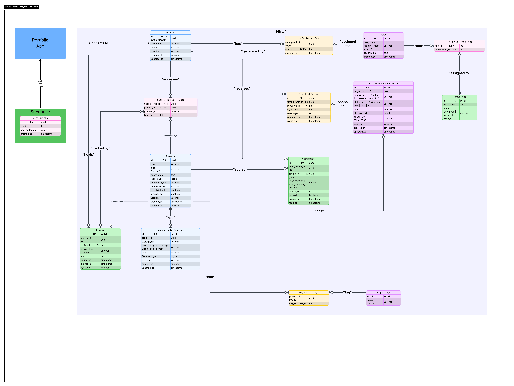

# Database Schema — Portfolio + Client Downloads

## Overall Architecture

```plain
┌─────────────────────┐         ┌──────────────────────────────┐
│     SUPABASE        │  UUID   │            NEON              │
│  auth.users ────────┼────────▶│  userProfile                 │
│  app_metadata       │  Next.js│  Projects, Resources         │
│  role: admin|client │  validates │  Licenses, Downloads      │
└─────────────────────┘         └──────────────────────────────┘
          │                                    │
          ▼                                    ▼
   Supabase Auth JWT                    Cloudflare R2
   Sessions / Tokens               temporary signed URLs
```



---

## ER Diagram

```mermaid
erDiagram

    AUTH_USERS {
        uuid      id            PK
        text      email
        jsonb     app_metadata
        timestamp created_at
    }

    userProfile {
        uuid      id            PK  "= auth.users.id"
        varchar   company
        varchar   phone
        varchar   country
        timestamp created_at
        timestamp updated_at
    }

    Roles {
        serial    id            PK
        varchar   role_name     "admin | client | viewer"
        text      description
        timestamp created_at
    }

    userProfile_has_Roles {
        uuid      user_profile_id   PK,FK
        int       role_id           PK,FK
        timestamp assigned_at
    }

    Permissions {
        serial    id            PK
        varchar   name          "download | preview | manage"
        text      description
    }

    Roles_has_Permissions {
        int       role_id         PK,FK
        int       permission_id   PK,FK
    }

    Projects {
        uuid      id                PK
        varchar   title
        varchar   slug              "unique"
        text      description
        jsonb     tech_stack
        varchar   repository_link
        varchar   thumbnail_ref
        boolean   is_publishable
        boolean   is_featured
        varchar   version
        timestamp created_at
        timestamp updated_at
    }

    Project_Tags {
        serial    id     PK
        varchar   name   "unique"
    }

    Projects_has_Tags {
        uuid      project_id   PK,FK
        int       tag_id       PK,FK
    }

    License {
        serial    id                PK
        uuid      user_profile_id   FK
        uuid      project_id        FK
        varchar   license_key       "unique"
        int       seats
        timestamp issued_at
        timestamp expires_at
        boolean   is_active
    }

    userProfile_has_Projects {
        uuid      user_profile_id   PK,FK
        uuid      project_id        PK,FK
        timestamp granted_at
        int       license_id        FK
    }

    Projects_Public_Resources {
        serial    id                PK
        uuid      project_id        FK
        varchar   storage_ref
        varchar   resource_type     "image | video | doc | demo"
        varchar   label
        bigint    file_size_bytes
        varchar   version
        timestamp created_at
        timestamp updated_at
    }

    Projects_Private_Resources {
        serial    id                PK
        uuid      project_id        FK
        varchar   storage_ref       "path in R2, never a direct URL"
        varchar   platform          "windows | mac | linux | all"
        varchar   label
        bigint    file_size_bytes
        varchar   checksum          "SHA-256"
        varchar   version
        timestamp created_at
        timestamp updated_at
    }

    Download_Record {
        serial    id                PK
        uuid      user_profile_id   FK
        int       resource_id       FK
        inet      ip_address
        text      user_agent
        timestamp requested_at
        timestamp expires_at
    }

    Notifications {
        serial    id                PK
        uuid      user_profile_id   FK
        uuid      project_id        FK
        varchar   type              "new_version | expiry_warning | custom"
        text      message
        boolean   is_read
        timestamp created_at
        timestamp read_at
    }

    userProfile                ||--o{ userProfile_has_Roles      : "has"
    Roles                      ||--o{ userProfile_has_Roles      : "assigned to"
    Roles                      ||--o{ Roles_has_Permissions      : "has"
    Permissions                ||--o{ Roles_has_Permissions      : "assigned to"
    userProfile                ||--o{ userProfile_has_Projects   : "accesses"
    Projects                   ||--o{ userProfile_has_Projects   : "accessed by"
    Projects                   ||--o{ Projects_has_Tags          : "has"
    Project_Tags               ||--o{ Projects_has_Tags          : "tag"
    userProfile                ||--o{ License                    : "holds"
    Projects                   ||--o{ License                    : "licensed for"
    userProfile_has_Projects   }o--o| License                    : "backed by"
    Projects                   ||--o{ Projects_Public_Resources  : "has"
    Projects                   ||--o{ Projects_Private_Resources : "has"
    Projects_Private_Resources ||--o{ Download_Record            : "logged in"
    userProfile                ||--o{ Download_Record            : "generated by"
    userProfile                ||--o{ Notifications              : "receives"
    Projects                   ||--o{ Notifications              : "source"
```



---

## System Breakdown

### Supabase

| Entity              | Notes                               |
| ------------------- | ----------------------------------- |
| `auth.users`        | Native, managed by Supabase Auth    |
| `app_metadata.role` | `admin` or `client`, no extra table |

### Neon

| Table                        | Notes                                     |
| ---------------------------- | ----------------------------------------- |
| `userProfile`                | PK = Supabase UUID. No real FK across DBs |
| `Roles` + `Permissions`      | Granular access control                   |
| `Projects`                   | Public and private portfolio              |
| `Project_Tags`               | Portfolio filtering                       |
| `License`                    | Expiration, seats, activation             |
| `userProfile_has_Projects`   | Which client can access which project     |
| `Projects_Public_Resources`  | Public images, demos, docs                |
| `Projects_Private_Resources` | Private installers and executables        |
| `Download_Record`            | Audit. Do not store URL, store the event  |
| `Notifications`              | New version or expiry notifications       |

### Cloudflare R2

| Bucket     | Contents                                     |
| ---------- | -------------------------------------------- |
| `public/`  | Thumbnails, portfolio images                 |
| `private/` | Installers and executables (signed URL only) |

---

## Download Flow

```plain
1. Client signs in
   └─▶ Supabase validates credentials → issues signed JWT

2. Client requests a download
   └─▶ Next.js extracts UUID from the JWT (never from the request body)
   └─▶ Query Neon: does userProfile_has_Projects exist?
   └─▶ Query Neon: does the user have the "download" permission?
   └─▶ Verify License.expires_at and is_active

3. Access authorized
   └─▶ Next.js generates an R2 signed URL with TTL (e.g., 30 min)
   └─▶ Inserts Download_Record (without storing the URL)
   └─▶ Returns only the URL to the client

4. Download
   └─▶ Direct connection Client ↔ R2
   └─▶ Vercel does not transfer a single byte of the file
```

---

## Changes vs. the Original Model (MySQL Workbench)

| Before                           | After                    | Why                                                    |
| -------------------------------- | ------------------------ | ------------------------------------------------------ |
| `AuthUser` as its own table      | Removed                  | It is Supabase `auth.users`; do not manage it yourself |
| Duplicated `Roles`               | Single table in Neon     | Supabase uses only `app_metadata.role` in the JWT      |
| `userProfile` with its own ID    | PK = Supabase UUID       | Removes unnecessary indirection                        |
| `temp_link` in `Download_Record` | Removed                  | Signed URLs expire; logging the event is enough        |
| No `License`                     | Separate `License` table | Enables expiration, seats, and per-product activation  |
| `VARCHAR(45)` for `description`  | `TEXT`                   | 45 characters is not enough for a sentence             |
| `TEXT` as PK                     | `UUID` / `SERIAL`        | More efficient indexes in PostgreSQL                   |

---

## DDL PostgreSQL

### SUPABASE

> The following tables and fields are managed automatically by Supabase Auth.
> They are documented here for reference only. **Do not run in Supabase.**

```sql
-- auth.users (reference, managed by Supabase Auth)
-- id           uuid
-- email        text
-- app_metadata jsonb  →  { "role": "admin" | "client" }
-- created_at   timestamp with time zone
```

To assign the role when creating a user from your backend:

```sql
-- From Supabase Admin SDK (in your Next.js Server Action):
-- supabaseAdmin.auth.admin.updateUserById(userId, {
--   app_metadata: { role: 'client' }
-- })
```

---

### NEON

```sql
-- ─────────────────────────────────────────────
-- EXTENSIONS
-- ─────────────────────────────────────────────
CREATE EXTENSION IF NOT EXISTS "pgcrypto"; -- for gen_random_uuid()


-- ─────────────────────────────────────────────
-- userProfile
-- PK = UUID from Supabase auth.users
-- There is no real FK across DBs; validation
-- happens in Next.js when reading the JWT.
-- ─────────────────────────────────────────────
CREATE TABLE IF NOT EXISTS user_profile (
    id          UUID            PRIMARY KEY,  -- = auth.users.id
    company     VARCHAR(100),
    phone       VARCHAR(30),
    country     VARCHAR(60),
    created_at  TIMESTAMPTZ     NOT NULL DEFAULT NOW(),
    updated_at  TIMESTAMPTZ     NOT NULL DEFAULT NOW()
);


-- ─────────────────────────────────────────────
-- ROLES
-- ─────────────────────────────────────────────
CREATE TABLE IF NOT EXISTS roles (
    id          SERIAL          PRIMARY KEY,
    role_name   VARCHAR(50)     NOT NULL UNIQUE,  -- 'admin' | 'client' | 'viewer' | 'project editor' | 'blog editor'
    description TEXT,
    created_at  TIMESTAMPTZ     NOT NULL DEFAULT NOW()
);

INSERT INTO roles (role_name, description) VALUES
    ('admin',  'Full system access'),
    ('client', 'Access to assigned projects and private downloads'),
    ('viewer', 'Read-only access to public projects'),
    ('project editor', 'Can create, edit, and delete projects'),
    ('blog editor', 'Can create, edit, and delete blog posts');


-- ─────────────────────────────────────────────
-- PERMISSIONS
-- ─────────────────────────────────────────────
CREATE TABLE IF NOT EXISTS permissions (
    id          SERIAL          PRIMARY KEY,
    name        VARCHAR(50)     NOT NULL UNIQUE,  -- 'download' | 'preview' | 'manage'
    description TEXT
);

INSERT INTO permissions (name, description) VALUES
    ('download', 'Can generate signed URLs and download private resources'),
    ('preview',  'Can view public resources and project metadata'),
    ('manage',   'Can create, edit, and delete projects and resources');


-- ─────────────────────────────────────────────
-- ROLES <-> PERMISSIONS
-- ─────────────────────────────────────────────
CREATE TABLE IF NOT EXISTS roles_has_permissions (
    role_id         INT     NOT NULL REFERENCES roles(id)       ON DELETE CASCADE,
    permission_id   INT     NOT NULL REFERENCES permissions(id) ON DELETE CASCADE,
    PRIMARY KEY (role_id, permission_id)
);

-- Initial permission assignment per role
INSERT INTO roles_has_permissions (role_id, permission_id)
SELECT r.id, p.id FROM roles r, permissions p
WHERE r.role_name = 'admin';  -- admin has all permissions

INSERT INTO roles_has_permissions (role_id, permission_id)
SELECT r.id, p.id FROM roles r, permissions p
WHERE r.role_name = 'client' AND p.name IN ('download', 'preview');

INSERT INTO roles_has_permissions (role_id, permission_id)
SELECT r.id, p.id FROM roles r, permissions p
WHERE r.role_name = 'viewer' AND p.name = 'preview';


-- ─────────────────────────────────────────────
-- PROFILE <-> ROLES
-- ─────────────────────────────────────────────
CREATE TABLE IF NOT EXISTS user_profile_has_roles (
    user_profile_id UUID    NOT NULL REFERENCES user_profile(id) ON DELETE CASCADE,
    role_id         INT     NOT NULL REFERENCES roles(id)        ON DELETE CASCADE,
    assigned_at     TIMESTAMPTZ NOT NULL DEFAULT NOW(),
    PRIMARY KEY (user_profile_id, role_id)
);


-- ─────────────────────────────────────────────
-- PROJECTS
-- ─────────────────────────────────────────────
CREATE TABLE IF NOT EXISTS projects (
    id              UUID            PRIMARY KEY DEFAULT gen_random_uuid(),
    title           VARCHAR(120)    NOT NULL,
    slug            VARCHAR(120)    NOT NULL UNIQUE,
    description     TEXT,
    tech_stack      JSONB,          -- e.g.: ["Next.js", "PostgreSQL", "Rust"]
    repository_link VARCHAR(500),
    thumbnail_ref   VARCHAR(500),   -- path in R2 or public URL
    is_publishable  BOOLEAN         NOT NULL DEFAULT FALSE,
    is_featured     BOOLEAN         NOT NULL DEFAULT FALSE,
    version         VARCHAR(30),
    created_at      TIMESTAMPTZ     NOT NULL DEFAULT NOW(),
    updated_at      TIMESTAMPTZ     NOT NULL DEFAULT NOW()
);


-- ─────────────────────────────────────────────
-- TAGS
-- ─────────────────────────────────────────────
CREATE TABLE IF NOT EXISTS project_tags (
    id      SERIAL          PRIMARY KEY,
    name    VARCHAR(50)     NOT NULL UNIQUE
);

CREATE TABLE IF NOT EXISTS projects_has_tags (
    project_id  UUID    NOT NULL REFERENCES projects(id)      ON DELETE CASCADE,
    tag_id      INT     NOT NULL REFERENCES project_tags(id)  ON DELETE CASCADE,
    PRIMARY KEY (project_id, tag_id)
);


-- ─────────────────────────────────────────────
-- LICENSES
-- ─────────────────────────────────────────────
CREATE TABLE IF NOT EXISTS license (
    id                  SERIAL          PRIMARY KEY,
    user_profile_id     UUID            NOT NULL REFERENCES user_profile(id) ON DELETE CASCADE,
    project_id          UUID            NOT NULL REFERENCES projects(id)     ON DELETE CASCADE,
    license_key         VARCHAR(100)    NOT NULL UNIQUE DEFAULT gen_random_uuid()::TEXT,
    seats               INT             NOT NULL DEFAULT 1,
    issued_at           TIMESTAMPTZ     NOT NULL DEFAULT NOW(),
    expires_at          TIMESTAMPTZ,    -- NULL = no expiration
    is_active           BOOLEAN         NOT NULL DEFAULT TRUE
);


-- ─────────────────────────────────────────────
-- PROFILE <-> PROJECTS  (access table)
-- ─────────────────────────────────────────────
CREATE TABLE IF NOT EXISTS user_profile_has_projects (
    user_profile_id UUID    NOT NULL REFERENCES user_profile(id) ON DELETE CASCADE,
    project_id      UUID    NOT NULL REFERENCES projects(id)     ON DELETE CASCADE,
    granted_at      TIMESTAMPTZ NOT NULL DEFAULT NOW(),
    license_id      INT         REFERENCES license(id)           ON DELETE SET NULL,
    PRIMARY KEY (user_profile_id, project_id)
);


-- ─────────────────────────────────────────────
-- PUBLIC RESOURCES
-- (images, demos, docs — public access)
-- ─────────────────────────────────────────────
CREATE TABLE IF NOT EXISTS projects_public_resources (
    id              SERIAL          PRIMARY KEY,
    project_id      UUID            NOT NULL REFERENCES projects(id) ON DELETE CASCADE,
    storage_ref     VARCHAR(500)    NOT NULL,   -- path in R2 or public URL
    resource_type   VARCHAR(30)     NOT NULL,   -- 'image' | 'video' | 'doc' | 'demo'
    label           VARCHAR(120),
    file_size_bytes BIGINT,
    version         VARCHAR(30),
    created_at      TIMESTAMPTZ     NOT NULL DEFAULT NOW(),
    updated_at      TIMESTAMPTZ     NOT NULL DEFAULT NOW()
);


-- ─────────────────────────────────────────────
-- PRIVATE RESOURCES
-- (installers, executables — signed URL only)
-- ─────────────────────────────────────────────
CREATE TABLE IF NOT EXISTS projects_private_resources (
    id              SERIAL          PRIMARY KEY,
    project_id      UUID            NOT NULL REFERENCES projects(id) ON DELETE CASCADE,
    storage_ref     VARCHAR(500)    NOT NULL,   -- path in R2, NEVER a direct URL
    platform        VARCHAR(20)     NOT NULL DEFAULT 'all', -- 'windows'|'mac'|'linux'|'all'
    label           VARCHAR(120),
    file_size_bytes BIGINT,
    checksum        VARCHAR(64),    -- file SHA-256 to verify integrity
    version         VARCHAR(30),
    created_at      TIMESTAMPTZ     NOT NULL DEFAULT NOW(),
    updated_at      TIMESTAMPTZ     NOT NULL DEFAULT NOW()
);


-- ─────────────────────────────────────────────
-- DOWNLOAD LOG (audit)
-- Do not store the signed URL, only the event.
-- ─────────────────────────────────────────────
CREATE TABLE IF NOT EXISTS download_record (
    id                  SERIAL          PRIMARY KEY,
    user_profile_id     UUID            NOT NULL REFERENCES user_profile(id)                    ON DELETE CASCADE,
    resource_id         INT             NOT NULL REFERENCES projects_private_resources(id)       ON DELETE CASCADE,
    ip_address          INET,
    user_agent          TEXT,
    requested_at        TIMESTAMPTZ     NOT NULL DEFAULT NOW(),
    expires_at          TIMESTAMPTZ     NOT NULL  -- when the generated signed URL expired
);


-- ─────────────────────────────────────────────
-- NOTIFICATIONS
-- ─────────────────────────────────────────────
CREATE TABLE IF NOT EXISTS notifications (
    id                  SERIAL          PRIMARY KEY,
    user_profile_id     UUID            NOT NULL REFERENCES user_profile(id) ON DELETE CASCADE,
    project_id          UUID            REFERENCES projects(id)              ON DELETE SET NULL,
    type                VARCHAR(50)     NOT NULL, -- 'new_version'|'expiry_warning'|'custom'
    message             TEXT            NOT NULL,
    is_read             BOOLEAN         NOT NULL DEFAULT FALSE,
    created_at          TIMESTAMPTZ     NOT NULL DEFAULT NOW(),
    read_at             TIMESTAMPTZ
);


-- ─────────────────────────────────────────────
-- INDEXES (frequent queries)
-- ─────────────────────────────────────────────
CREATE INDEX IF NOT EXISTS idx_projects_slug
    ON projects(slug);

CREATE INDEX IF NOT EXISTS idx_projects_publishable
    ON projects(is_publishable) WHERE is_publishable = TRUE;

CREATE INDEX IF NOT EXISTS idx_user_profile_has_projects_user
    ON user_profile_has_projects(user_profile_id);

CREATE INDEX IF NOT EXISTS idx_download_record_user
    ON download_record(user_profile_id);

CREATE INDEX IF NOT EXISTS idx_download_record_resource
    ON download_record(resource_id);

CREATE INDEX IF NOT EXISTS idx_notifications_user_unread
    ON notifications(user_profile_id) WHERE is_read = FALSE;

CREATE INDEX IF NOT EXISTS idx_license_active
    ON license(user_profile_id, project_id) WHERE is_active = TRUE;


-- ─────────────────────────────────────────────
-- TRIGGER: automatic updated_at
-- ─────────────────────────────────────────────
CREATE OR REPLACE FUNCTION set_updated_at()
RETURNS TRIGGER AS $$
BEGIN
    NEW.updated_at = NOW();
    RETURN NEW;
END;
$$ LANGUAGE plpgsql;

CREATE TRIGGER trg_projects_updated_at
    BEFORE UPDATE ON projects
    FOR EACH ROW EXECUTE FUNCTION set_updated_at();

CREATE TRIGGER trg_user_profile_updated_at
    BEFORE UPDATE ON user_profile
    FOR EACH ROW EXECUTE FUNCTION set_updated_at();

CREATE TRIGGER trg_public_resources_updated_at
    BEFORE UPDATE ON projects_public_resources
    FOR EACH ROW EXECUTE FUNCTION set_updated_at();

CREATE TRIGGER trg_private_resources_updated_at
    BEFORE UPDATE ON projects_private_resources
    FOR EACH ROW EXECUTE FUNCTION set_updated_at();
```
